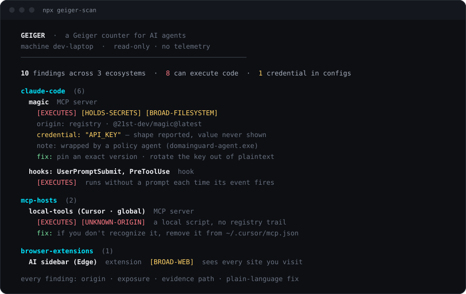
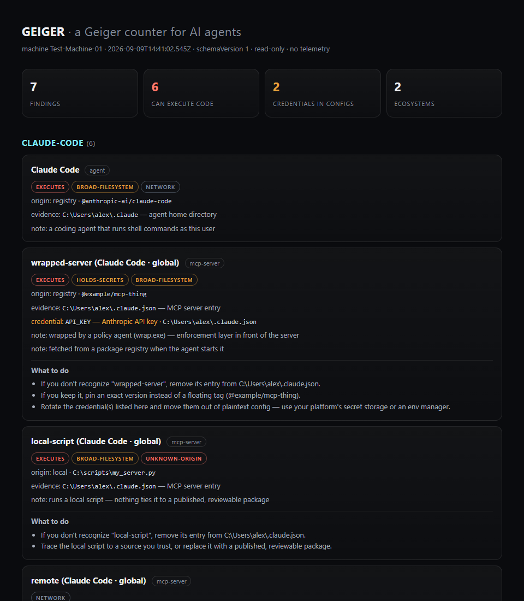

# geiger

[](https://github.com/Atomburstofficial/geiger/actions/workflows/ci.yml)
[](https://www.npmjs.com/package/geiger-scan)
[](LICENSE)


**A Geiger counter for AI agents.**

One read-only command that inventories every AI agent, harness, MCP server,
plugin, and AI extension on a machine — and tells you, in plain language,
what each one can touch.

```
npx geiger-scan
```

No install. No account. No telemetry. Reads configs and directories, writes
nothing (unless you ask for `--json yourfile.json`).



## Why this exists

In August 2026, an open-source agent harness went from zero to 200,000+
GitHub stars in three weeks. Its plugin ecosystem passed 13,000 repositories
in the same window. One-click desktop clients appeared the same day it
launched. Instagram carousels now teach office workers to install all of it.

Every one of those installs is a program that can execute commands, read
files, and hold credentials — configured in dotfiles nobody looks at twice.
Ask yourself the question this tool answers: **what is actually running on
this machine, and what can it reach?** Most people cannot answer it. Now
it's one command.

## What a scan looks like

```
  GEIGER  ·  a Geiger counter for AI agents
  machine dev-laptop  ·  2026-09-06 12:24 UTC  ·  read-only · no telemetry
  ──────────────────────────────────────────────────────────────

  9 findings across 3 ecosystems  ·  7 can execute code  ·  1 credential in config files

  claude-code  (6)
    Claude Code  agent
      [EXECUTES] [BROAD-FILESYSTEM] [NETWORK]
      origin: registry · @anthropic-ai/claude-code
    magic (Claude Code · global)  MCP server
      [EXECUTES] [HOLDS-SECRETS] [BROAD-FILESYSTEM]
      origin: registry · @21st-dev/magic@latest
      credential: "API_KEY" — opaque value under a credential-named key · ~/.claude.json
      note: wrapped by a policy agent (domainguard-agent.exe) — enforcement layer in front of the server
    hooks: UserPromptSubmit, PreToolUse  hook
      [EXECUTES]
      note: hooks execute without a prompt each time their event fires
  ...
```

Real output from a real machine (values redacted — see below).

## What it detects

| Ecosystem | What geiger reads |
|---|---|
| **Claude Code** | global + per-project MCP servers, hooks, plugins, skills, subagents, `apiKeyHelper` |
| **MCP hosts** | Claude Desktop, Cursor, Windsurf, VS Code (user + project), Cline, Roo Code, Continue, Zed |
| **Other agents** | Codex CLI, Gemini CLI, Kilo CLI, Grok Build, Aider, OpenCode, Qwen Code, DeepSeek Harness, Continue, GitHub Copilot CLI, Goose, JetBrains Junie, Open Interpreter, LM Studio, Ollama |
| **Editor extensions** | AI extensions in VS Code / Insiders / Cursor |
| **JetBrains IDEs** | AI Assistant / MCP settings presence per product (the settings live inside the IDE — geiger points you at the right screen) |
| **Global CLIs** | agent packages in global npm roots (read directly — npm is never executed) |
| **Browser extensions** | AI extensions in Chrome / Edge / Brave / Firefox profiles, with their granted permissions |

Every finding gets: what it is, where it came from (registry, store, git,
local script, remote server — or **UNKNOWN-ORIGIN**), what it can do
(**EXECUTES**, **HOLDS-SECRETS**, **BROAD-FILESYSTEM**, **BROAD-WEB**,
**NETWORK**), and the evidence path so you can verify by hand.

Geiger also recognizes **policy wrappers** (agents that put an enforcement
layer in front of MCP servers) and reports both layers instead of hiding the
real server behind the wrapper.

## The three promises

1. **Read-only.** The only write geiger ever performs is the `--json` file
   you explicitly name.
2. **No telemetry.** Nothing leaves your machine. There is no endpoint to
   send anything to. (This also means we have no idea how many people use
   this — a trade we're happy with.)
3. **Secrets by shape only.** When a credential-shaped value is found in a
   config, geiger reports the key name, the file, and what kind of secret it
   looks like — never any part of the value. A redaction pass runs on all
   output as defense-in-depth, and the test suite enforces it.

## Requirements

**Node.js 18 or newer. That's it.** Node ships with `npm` and `npx`, and
geiger has zero dependencies, so nothing else gets installed. No global
install, no admin rights, no account.

If Node isn't on the machine yet, it's one command with the package manager
you already have — then open a new terminal so `npx` is on the path:

```
winget install OpenJS.NodeJS.LTS      # Windows
brew install node                     # macOS (Homebrew)
sudo apt install nodejs npm           # Debian / Ubuntu
```

Other platforms and version managers (nvm, fnm): https://nodejs.org/en/download

## Usage

```
npx geiger-scan                        scan, print the report
npx geiger-scan --html report.html     self-contained HTML report with per-finding
                                       "what to do" remediation guidance
npx geiger-scan --json out.json        machine-readable findings (schemaVersion 1)
npx geiger-scan --path D:\repo1 --path E:\repo2
                                       also scan these project directories for
                                       project-level agent and MCP configs
npx geiger-scan --home C:\Users\other  scan a different home root (another user
                                       profile, a mounted image)
npx geiger-scan --strict               exit 2 if anything can execute code or
                                       holds secrets
npx geiger-scan --diff baseline.json   compare against an earlier --json
                                       snapshot: what appeared, disappeared,
                                       or escalated since then
```

**Drift alarm:** once you've reviewed a machine, save a baseline
(`--json baseline.json`) and put `geiger-scan --strict --diff baseline.json`
in cron or CI. It exits 2 only when something **new** can execute code or
hold secrets — the standing, already-reviewed inventory stays quiet. Same
mental model as a lockfile: accept what's there, alarm on change.

Registry blocked, or want the unreleased `main`?
`npx github:Atomburstofficial/geiger` runs straight from this repo (still
needs Node — see [Requirements](#requirements)).

## What the reports look like

Before running anything, see exactly what you'd get: a
[sample HTML report](docs/sample-report.html) and a
[sample JSON output](docs/sample-report.json) live in this repo, generated
from the test fixture — synthetic data, generic paths, credentials shown by
shape only (as always). The HTML report:



Every finding that warrants action carries plain-language remediation — as
`fix:` lines in the terminal and "What to do" blocks in the HTML report.

Fleet pattern (MSPs, IT): run with `--json` per machine on a schedule (an
RMM task or login script writing `%COMPUTERNAME%.json` to a share), keep
each machine's baseline, and let `--diff` report per-machine drift. The
schema is versioned and stable. Geiger never phones home — the JSON files
travel only where you put them.

## Limitations

Stated up front, because a scanner you overtrust is worse than no scanner:

- Geiger reads **known config locations**. Agents installed in nonstandard
  paths, other user accounts, containers, or WSL (from the Windows side)
  are not seen.
- It reads **configuration, not runtime behavior**. It cannot tell you what
  a plugin actually did — only what its position allows.
- It cannot judge whether a package is malicious — only where it came from
  and what it can reach. Origin ≠ trustworthiness.
- Partially-parseable formats (TOML configs) are scanned by shape and
  flagged with reduced confidence rather than skipped.
- The ecosystem this tool audits changes weekly. Detectors are data-driven
  and small on purpose — see [CONTRIBUTING.md](CONTRIBUTING.md) to add one.

## FAQ

**Is this a security audit?** No. It's an inventory with honest exposure
labels — the thing you need *before* any audit means anything.

**Why should I trust a security company's free scanner?** Read it. It's a
few hundred lines of dependency-free JavaScript, and what's published is
what runs — releases are published from GitHub Actions with [npm
provenance](https://docs.npmjs.com/generating-provenance-statements), so the
npm page carries a signed link to the exact public commit each version was
built from.

**What do I do about what it finds?** Individually: remove what you don't
recognize, rotate credentials that shouldn't be sitting in configs. At a
company: that's policy enforcement, which is a different product —
[DomainGuard](https://atomburst.io/domainguard) is how organizations put a
policy layer in front of this surface. Geiger stays free and standalone
either way.

## License

[MIT](LICENSE) · built by
[Atomburst](https://atomburst.io/geiger?utm_source=github&utm_medium=readme) ·
zero runtime dependencies, no build step — the source you read is the code
that runs.
